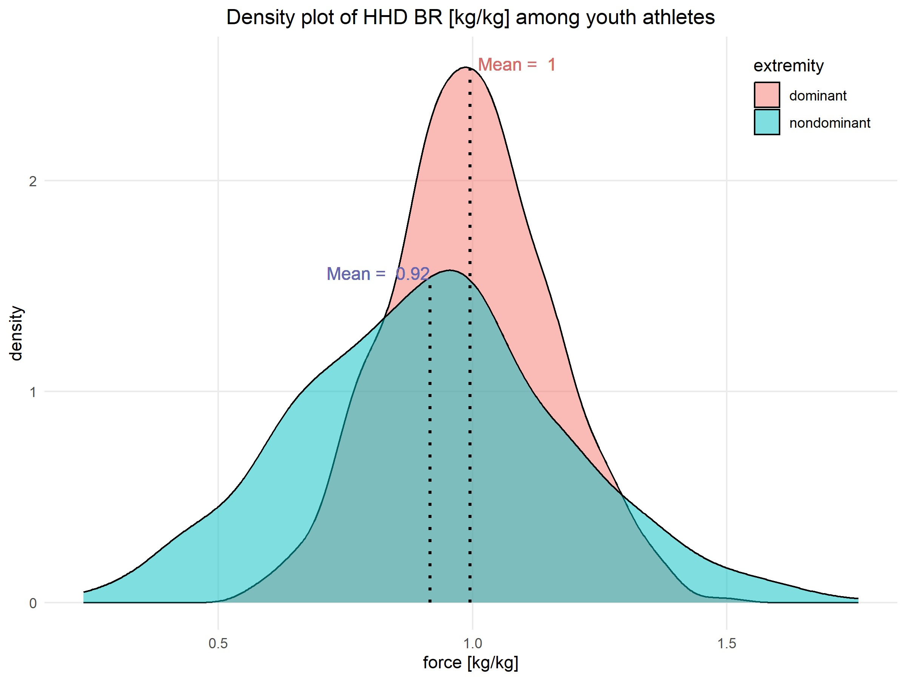
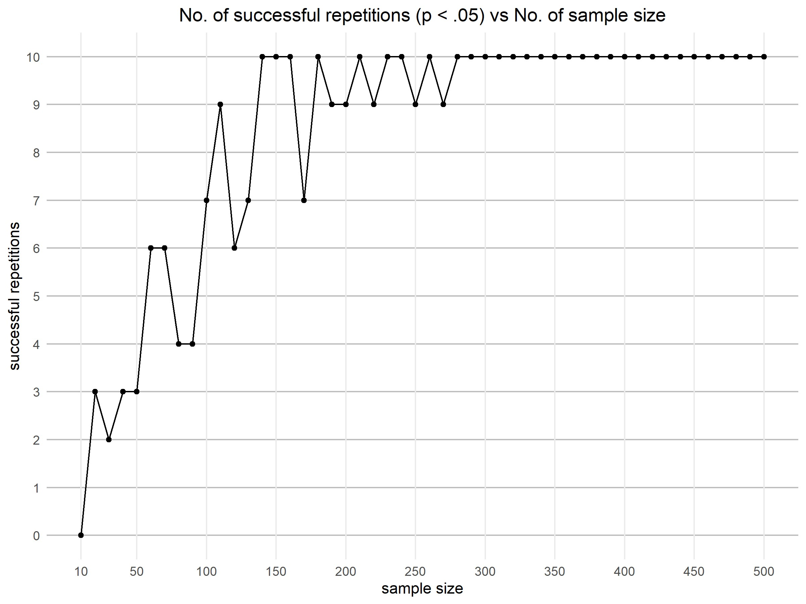

# Experiment Design

The data analysed in this project were synthetically generated based on a real study on youth athletes sport performance. The analysis focuses on measurements of the force produced by the gastrocnemius muscle (musculus gastrocnemius, referred to in Polish as brzuchaty łydki, BR). These data were generated using the mean and standard deviation calculated from real dataset measurements.

The measurements are expressed in normalized units of kilogram force (kg/kg).
Each participant contributed two measurements: one for the left extremity and one for the right extremity. These can be categorized as belonging to either the dominant or non-dominant extremity, depending on the participant's functional dominance.
Here, the null hypothesis is that the mean force measurements of the dominant and non-dominant extremities do not differ. The alternative hypothesis states that there is a significant difference between the two means. Given that the two groups are dependent (each participant contributes to both groups), a paired statistical test was used. For parametric data, a paired t-test was intended, and the Wilcoxon signed-rank test for non-parametric data. Before selecting the appropriate statistical test, the following assumptions were evaluated:
1. Normality of data: The Shapiro-Wilk test was used to determine whether the force measurements followed a normal distribution.
2. Homogeneity of variances: The Levene's test was performed to assess whether the variances of the two groups were equal.

## Results

Summarised data is presented in the form of a density plot for both extremities, dominant and nondominant (see **Figure 1**). A minimal sample size of 𝑛 = 280 was determined to consistently yield statistically significant results (𝑝<.05) in at least 10 consecutive repetitions of the test. Although 𝑛 = 140 was the first sample size to achieve 10 consecutive successes, for 𝑛 ≥ 280, no instances of fewer than 10 out of 10 successes were observed (see **Figure 2**). The Wilcoxon signed-rank test revealed a
significant difference (𝑉 = 25301; 𝑝 < .001). This indicates that the true location shift between the groups is not equal to zero. The findings indicate that there is a statistically significant difference in the force measurements between the dominant and non-dominant extremities in youth athletes. These results suggest potential asymmetry in muscle strength.

**Figure 1.** Density plot of BR force for dominant and nondominant extremities.

**Figure 2.** Number of successful repetitions as a function of sample size.
